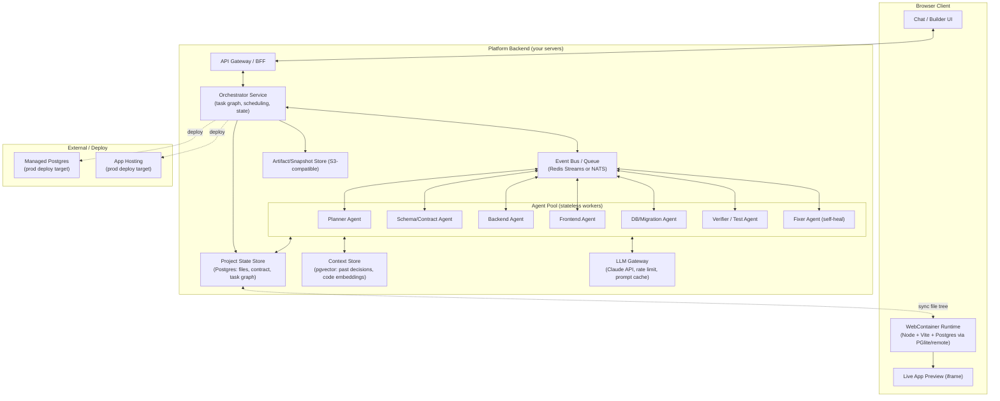
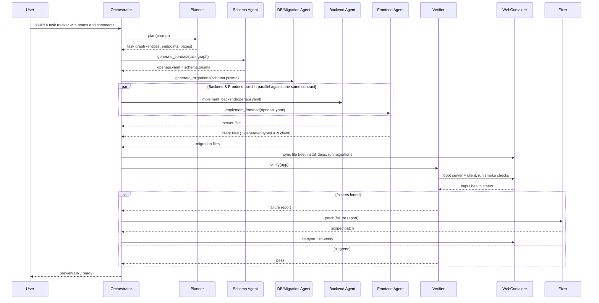
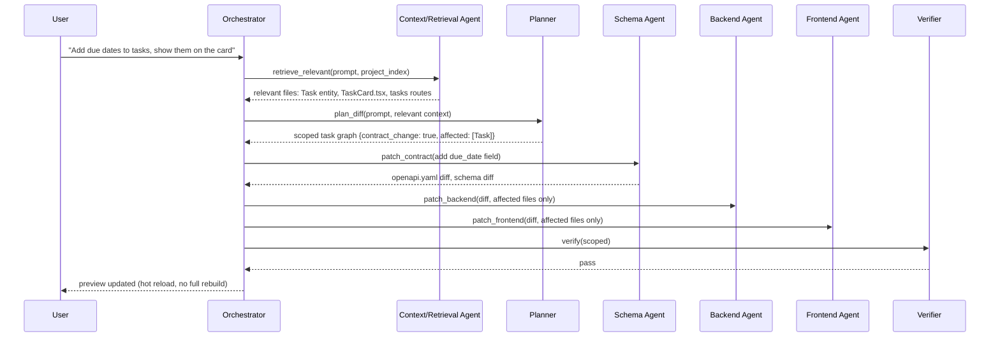
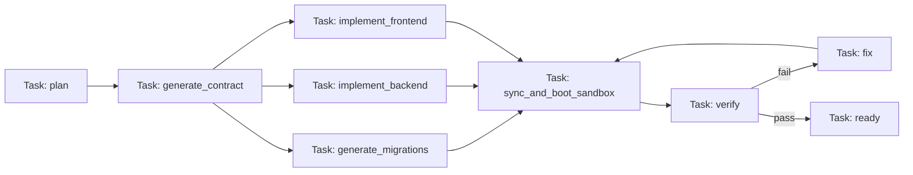
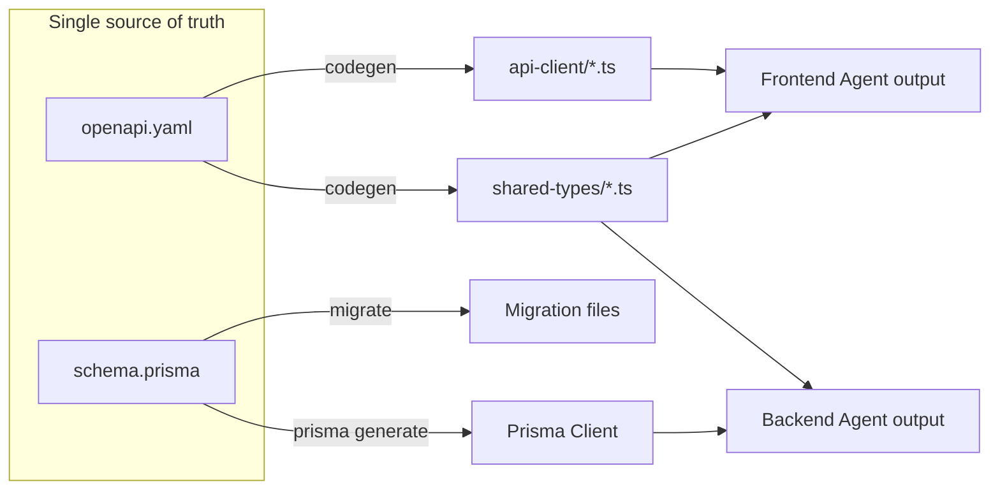
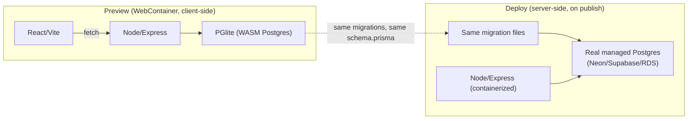
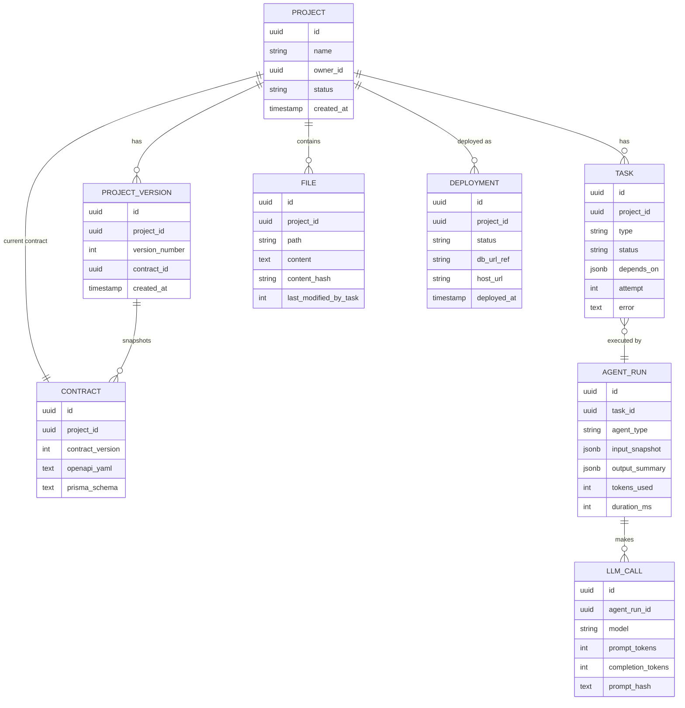
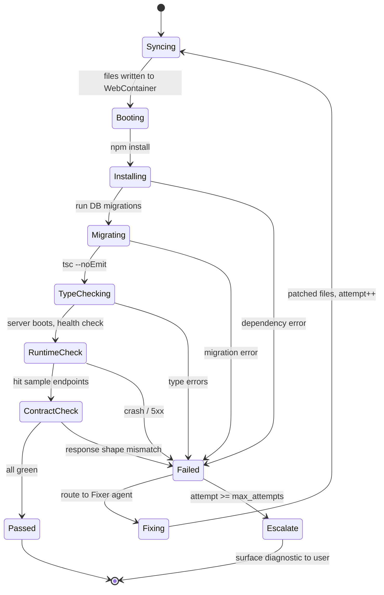

# Multi-Agent Vibe-Coding Platform — Architecture Document

**Stack**: Next (frontend) + Node/Express (backend) + PostgreSQL (database) **Runtime**: WebContainers (in-browser Node runtime, StackBlitz-style)
**Scope**: Full production-grade architecture, with an explicit MVP cut at the end

---

## 1. Goals & Design Principles

**Goal**: given a natural-language prompt, produce a working full-stack app (DB schema → backend API → frontend UI), preview it live in-browser, let the user iterate conversationally, and keep iterating without regenerating the whole app on every message.

Your two instincts — an orchestrator over specialized parallel agents, and an OpenAPI contract as shared source of truth — are exactly right and are the backbone of this design. Formalizing them as principles:

1. **Contract-first, not code-first.** An OpenAPI spec + a DB schema are generated *before* any implementation code, and every agent treats them as ground truth. Frontend and backend agents compile against the contract, never against each other's code directly.
2. **Orchestrator/worker parallelism.** A central orchestrator decomposes a request into a task graph (DAG), assigns nodes to specialized agents, and runs independent nodes concurrently. Agents talk to the orchestrator and to the contract — never directly to each other.
3. **Idempotent, resumable tasks.** Any step can fail (LLM error, bad codegen, flaky sandbox command). Every task is retryable from its last checkpoint, never from zero.
4. **Small blast radius per edit.** After the first generation, iteration ("make the button blue", "add a comments table") should touch the minimum files/agents — not re-run the whole pipeline. This is the biggest lever on both cost and perceived speed, and it's where these platforms actually differentiate.
5. **The sandbox is a first-class citizen.** The WebContainer isn't just a preview surface — agents use it to type-check, run migrations, and self-correct *before* the user ever sees broken output.

---


## 2. High-Level Architecture (HLD)




**Why this shape:**

- The **orchestrator** never writes code itself — it plans, schedules, and merges. This keeps it cheap to run (small/fast model or even non-LLM logic for scheduling) and easy to reason about.
- Agents are **stateless workers** pulled from a pool via the event bus — this is what gives you real parallelism and horizontal scaling, and it means a crashed agent just gets retried by another worker.
- The **WebContainer runs client-side**, but the **source of truth for files is server-side** (Project State Store). The browser is a synced execution surface, not the owner of state — this matters a lot once you support multi-device, collaboration, or resuming a session on a different tab.
- **Postgres-in-the-browser** is the trickiest part of your WebContainer choice — covered in detail in §7.

---


## 3. Agent Roster


| Agent               | Responsibility                                                                                                                         | Reads                                           | Writes                                                   |
| ------------------- | -------------------------------------------------------------------------------------------------------------------------------------- | ----------------------------------------------- | -------------------------------------------------------- |
| **Planner**         | Turns the user prompt into a task graph: entities, features, pages, endpoints. Decides what changed on follow-up prompts (diff-aware). | User prompt, existing contract, project summary | Task graph (DAG)                                         |
| **Schema/Contract** | Owns the OpenAPI spec + DB schema (Prisma/Drizzle schema). This is the *only* agent allowed to change the contract.                    | Task graph                                      | `openapi.yaml`, `schema.prisma`, TypeScript shared types |
| **DB/Migration**    | Generates migrations from schema diffs, seeds data, validates constraints                                                              | `schema.prisma` diff                            | Migration files, seed scripts                            |
| **Backend**         | Implements Express routes/controllers/services against the OpenAPI spec                                                                | `openapi.yaml`, `schema.prisma`                 | `/server/`**                                             |
| **Frontend**        | Implements React components/pages, generates a typed API client *from* the OpenAPI spec (never hand-writes fetch calls)                | `openapi.yaml`, design tokens                   | `/client/`**, generated `api-client/`                    |
| **Verifier**        | Runs typecheck, lint, contract-conformance tests, boots the app in the WebContainer, hits health endpoints                             | Full file tree                                  | Test/verification report                                 |
| **Fixer**           | Consumes verifier failures, patches the smallest possible diff, re-triggers verification                                               | Error logs, failing files                       | Patched files (scoped)                                   |


Two more that matter for a real product:


| Agent                       | Responsibility                                                                                                                                                                                                                                    |
| --------------------------- | ------------------------------------------------------------------------------------------------------------------------------------------------------------------------------------------------------------------------------------------------- |
| **Context/Retrieval Agent** | Not a codegen agent — a retrieval helper. Given a follow-up prompt, finds which files/entities/endpoints are relevant so the Planner doesn't have to stuff the whole codebase into context. Backed by pgvector over file summaries + AST symbols. |
| **Deploy Agent**            | Provisions managed Postgres + hosting, runs migrations against prod, promotes a snapshot. Only invoked on explicit "deploy" action, never mid-iteration.                                                                                          |


**Design rule**: only the Schema/Contract agent can mutate `openapi.yaml`. If the Backend or Frontend agent's task requires a contract change (e.g., "add a field"), it doesn't do it inline — it raises a `contract_change_request` back to the orchestrator, which re-invokes the Schema agent first. This is the enforcement mechanism that actually makes "contract-first" real instead of aspirational.

---


## 4. Orchestration Flow (Sequence)


### 4.1 First generation (cold start)




Key point: **Backend and Frontend genuinely run in parallel** because they both depend only on the contract, not on each other — this is the payoff of principle #1. The DB migration agent can also run concurrently with them since it depends on the schema, not on backend/frontend code.

### 4.2 Follow-up iteration (the case that matters most in practice)




The **Context/Retrieval Agent is what keeps iteration cheap and fast** — without it, every follow-up either re-sends the whole codebase to every agent (expensive, slow, and actually *worse* quality due to context dilution) or risks missing a relevant file. This is the piece most tutorials skip and most production platforms invest heavily in.

---


## 5. LLD: Task Graph & Orchestrator Internals

The orchestrator's core data structure is a **DAG of tasks**, not a linear pipeline. This is what makes "parallel work" a real scheduling property instead of just an aspiration.




**Task record schema** (stored in the Project State Store, not just in memory — this is what makes tasks resumable across orchestrator restarts):

```
Task {
  id: uuid
  project_id: uuid
  type: enum(plan, generate_contract, generate_migrations,
             implement_backend, implement_frontend, sync_sandbox,
             verify, fix, deploy)
  status: enum(pending, ready, running, blocked, failed, done)
  depends_on: [task_id]
  input_ref: pointer to contract version / file set this task reads
  output_ref: pointer to files/artifacts this task produced
  attempt: int
  max_attempts: int
  agent_assigned: string | null
  error: string | null
  created_at, started_at, finished_at
}
```

**Scheduling algorithm** (runs on every state change event from the bus):

1. Find all tasks with `status = pending` whose `depends_on` are all `done`.
2. Mark them `ready`, publish to the queue with their `type` as the routing key.
3. An idle agent worker of the matching type claims a `ready` task (status → `running`) via an atomic `UPDATE ... WHERE status='ready'` (optimistic lock — prevents double-claiming).
4. On completion, worker writes `output_ref`, sets `status=done`, publishes a `task.completed` event.
5. On failure, increment `attempt`; if `< max_attempts`, requeue; else mark `failed` and surface to the orchestrator's error-handling logic, which for most failure types routes to the **Fixer** agent rather than surfacing raw errors to the user.

This is a fairly standard **DAG scheduler pattern** (conceptually similar to Airflow/Temporal) — you don't need to build a workflow engine from scratch; using something like **Temporal.io** or **Inngest** for this layer specifically is a very reasonable production choice, since retries, backoff, and durable execution are exactly their job. Rolling your own is fine for MVP (a Postgres table + Redis queue gets you 90% of the way).

---


## 6. LLD: Contract-First Workflow

This is the mechanism that actually enforces principle #1, not just names it.

**Artifacts that make up "the contract":**

- `openapi.yaml` — endpoints, request/response schemas, auth requirements
- `schema.prisma` (or `schema.sql`) — DB tables, relations, constraints
- `shared-types/` — TS types **generated from** the OpenAPI spec (via `openapi-typescript` or similar) — never hand-written, so they can't drift
- `api-client/` — a typed fetch client **generated from** the OpenAPI spec (via `openapi-typescript-codegen` or `orval`) — the Frontend agent imports this, it never writes raw `fetch()` calls to backend routes




**Contract-conformance check** (part of the Verifier's job, not optional):

- Backend: does every route in `openapi.yaml` exist and return the declared status codes/shapes? (`dredd` or a custom OpenAPI-diff-against-runtime tool)
- Frontend: does the build fail if a component uses a field/endpoint not present in `shared-types`/`api-client`? (this falls out for free from TypeScript strictness if frontend never bypasses the generated client)
- Any drift is treated as a **verifier failure**, routed to the Fixer, exactly like a runtime bug.

**Versioning the contract**: every accepted contract change gets a monotonic `contract_version`. Task records reference the version they were generated against, so if two contract changes race (rare, but possible with concurrent user edits), the orchestrator can detect a task was built against a stale version and re-run it rather than silently merging inconsistent code.

---


## 7. WebContainers + Postgres — The Hard Part of Your Runtime Choice

You picked WebContainers, which is great for instant, zero-infra previews of Node/Express + React — but **Postgres cannot run inside a WebContainer** (it's not a real Linux VM, no native binaries). You have three real options; pick one explicitly rather than discovering the gap mid-build:


| Option                                       | How it works                                                                                                                                                               | Tradeoffs                                                                                                                                                                                                                                                       |
| -------------------------------------------- | -------------------------------------------------------------------------------------------------------------------------------------------------------------------------- | --------------------------------------------------------------------------------------------------------------------------------------------------------------------------------------------------------------------------------------------------------------- |
| **A. PGlite (WASM Postgres) in-browser**     | Run [PGlite](https://pglite.dev) — a WASM build of Postgres — inside the WebContainer/browser tab alongside the Node server                                                | Fully client-side, zero backend cost for preview, fast. But: not 100% Postgres-compatible (no extensions like pgvector inside it, some SQL edge cases differ), data is ephemeral per tab unless you persist to IndexedDB/OPFS. **Recommended for MVP preview.** |
| **B. Ephemeral remote Postgres per project** | Spin up a real (containerized or Neon/Supabase branch) Postgres instance server-side per project session, WebContainer's Node server connects to it over the network       | 100% real Postgres, matches prod exactly, supports extensions                                                                                                                                                                                                   |
| **C. Hybrid**                                | PGlite for the fast default preview; "real Postgres" mode is a one-click upgrade for projects that need extensions/scale, or automatically switched to at deploy-prep time | Best UX, more moving parts                                                                                                                                                                                                                                      |


**Recommendation**: build the MVP on **Option A (PGlite)** since it keeps you fully client-side and matches "instant preview" expectations, and treat the **Deploy Agent's job** as: take the PGlite schema/migrations, apply them to a **real managed Postgres** (Neon/Supabase/RDS) at deploy time. This means migrations must always be written as portable SQL/Prisma migrations, never PGlite-specific — which is good discipline anyway.




**Sync mechanism** (server file tree ↔ WebContainer): the Project State Store is the source of truth (§8). The client subscribes to a file-diff stream (via the event bus over WebSocket/SSE) and applies incremental `fs.writeFile` calls into the WebContainer's virtual FS — never a full re-download of the project on every change. This is also what makes hot-reload on iteration (§4.2) feel instant.

---


## 8. Platform Data Model (the platform's own DB, not the generated app's DB)




Notes:

- `FILE` rows, not a git repo, are the primary store for MVP simplicity — but model it so a **git-backed store is a drop-in replacement later** (e.g., every `PROJECT_VERSION` could map to a commit). Many teams end up wanting real git export eventually; don't paint yourself into a corner.
- `AGENT_RUN` + `LLM_CALL` exist for **cost accounting and debuggability** — you will want per-project token cost and the ability to replay "what exactly did the Backend agent see when it wrote this file" from day one, not bolted on later.
- `content_hash` on `FILE` lets the Context/Retrieval Agent and the sync-to-WebContainer mechanism both skip unchanged files cheaply.

---


## 9. LLD: Self-Healing / Verify-Fix Loop

This loop is what separates a demo from a product — raw LLM codegen has a non-trivial failure rate, and users should almost never see a red screen.




**Fixer agent scoping rule**: the Fixer receives *only* the failing file(s), the specific error (stack trace / typecheck diagnostic / contract diff), and the relevant contract slice — not the whole project. This keeps fixes cheap and, more importantly, prevents the classic failure mode of an LLM "fixing" a type error by quietly rewriting unrelated working code.

**Escalation policy** (`max_attempts`, e.g. 3): if the loop can't self-heal, don't keep burning tokens — surface a clear diagnostic to the user ("I generated the comments feature but the migration is failing because of X — here's what I tried") rather than silently looping or silently shipping broken code. This is both a cost control and a trust control.

---


## 10. Platform's Own Tech Stack (recommendation)

Distinct from the *generated* app's stack (React/Node/Postgres) — this is what you build the platform itself with:


| Layer                   | Recommendation                                                                                                             | Why                                                                                                                               |
| ----------------------- | -------------------------------------------------------------------------------------------------------------------------- | --------------------------------------------------------------------------------------------------------------------------------- |
| API Gateway / BFF       | Node (Fastify or Express)                                                                                                  | Same language as your codegen target, easy to share types with agents                                                             |
| Orchestrator            | Node service + Postgres-backed task table, or **Temporal.io**                                                              | Temporal buys you durable execution, retries, and visibility into running workflows for free — very worth it once you're past MVP |
| Event bus / queue       | Redis Streams (MVP) → NATS or Kafka (scale)                                                                                | Redis Streams is enough until you have real multi-tenant concurrency; don't over-build this early                                 |
| Agent workers           | Stateless Node processes (or Python if you prefer for LLM-heavy logic), horizontally scaled, pulling from the queue        | Statelessness is what lets you scale agents independently per type (e.g., more Frontend workers than Deploy workers)              |
| LLM Gateway             | Thin internal service wrapping the Claude API: handles retries, prompt caching, per-agent system prompts, token accounting | Centralizing this avoids every agent reinventing retry/backoff logic and gives you one place to swap models per agent type        |
| Project State Store     | Postgres                                                                                                                   | Matches your own stack expertise, transactional guarantees for task state                                                         |
| Context Store           | Postgres + pgvector                                                                                                        | No need for a separate vector DB at this scale; pgvector is plenty                                                                |
| Artifact/Snapshot store | S3-compatible (S3/R2)                                                                                                      | Cheap storage for full project snapshots, exports, rollback points                                                                |
| Sandbox (preview)       | WebContainers (client) + PGlite                                                                                            | Per your requirements                                                                                                             |
| Sandbox (deploy target) | Managed Postgres (Neon/Supabase/RDS) + container hosting (Fly.io/Railway/ECS)                                              | Real Postgres + real Node runtime for the shipped app                                                                             |


---


## 11. Security & Isolation

- **Prompt injection from generated code / user prompts into agent tool calls**: agents should have *narrowly scoped tools* (e.g., Backend agent can write to `/server/`** only, never `/client/**` or infra config) enforced at the tool-execution layer, not just by prompting the agent to behave.
- **Sandbox escape**: WebContainers are already browser-sandboxed (no real OS access), which is a genuine security advantage of your choice over spawning real Docker containers per user — worth keeping in mind as a plus, not just a limitation.
- **Server-side execution risk**: anything that *does* run server-side (Verifier calls to a real backend for contract checks, or Deploy Agent provisioning) must run in ephemeral, network-isolated containers (gVisor/Firecracker) with no access to other tenants' data or your platform's own secrets.
- **Secrets in generated apps**: never let an agent hardcode API keys/DB credentials into generated files. Inject via env vars at deploy time, template placeholders during generation.
- **Multi-tenant data isolation**: Project State Store rows scoped by `project_id` + row-level security in Postgres if you go multi-tenant-in-one-DB; per-tenant DB is safer but pricier — reasonable to defer past MVP.
- **LLM output validation**: never `eval` or directly execute LLM-generated shell commands without an allowlist (e.g., only `npm install`, `npx prisma migrate`, predefined build/test commands — no arbitrary shell).

---


## 12. Scaling Considerations

- **Agent pool autoscaling**: scale worker replicas per agent *type* based on queue depth per task type — Frontend/Backend tasks will dominate volume; Deploy tasks are rare and can run with a small fixed pool.
- **LLM rate limits & cost**: the LLM Gateway should implement per-project and global token budgets, plus **prompt caching** aggressively — the contract (`openapi.yaml`, `schema.prisma`) barely changes between consecutive agent calls in the same session, which is exactly what prompt caching is built for and can cut costs substantially.
- **WebContainer resource limits**: these run in the user's browser tab, so "scaling" here really means graceful degradation — cap project size, warn on large dependency installs, and lazy-load only the files needed for the current view rather than syncing an entire large project tree at once.
- **Hot path vs cold path**: first generation (cold) can tolerate 30-90s; iteration (hot) should target single-digit seconds. Design your caching and scoping (§4.2, §9) around making the *hot* path fast — that's the one users feel on every message.
- **Idle project suspension**: for Option B/C real-Postgres previews, auto-suspend idle project databases (Neon branches support this natively) to control cost.

---


## 13. Failure Modes & Mitigations (quick reference)


| Failure                                                            | Mitigation                                                                                                        |
| ------------------------------------------------------------------ | ----------------------------------------------------------------------------------------------------------------- |
| Two agents produce contract-incompatible assumptions               | Contract is single-writer (Schema agent only); others request changes, never author them                          |
| LLM generates code referencing non-existent endpoint/field         | Contract-conformance check in Verifier catches it before user sees it                                             |
| Iteration prompt is ambiguous ("make it better")                   | Planner asks a clarifying question via orchestrator → user, rather than guessing and burning a full cycle         |
| Fixer loops without converging                                     | `max_attempts` cap + escalation to user with diagnostic                                                           |
| Orchestrator crashes mid-run                                       | Task state persisted in Postgres, not memory — new orchestrator instance resumes from last task state             |
| Contract changes race (concurrent edits)                           | Monotonic `contract_version`, stale-version detection re-runs affected tasks                                      |
| WebContainer/PGlite diverges from real Postgres behavior at deploy | Migrations always written as portable SQL/Prisma, tested against real Postgres in Deploy Agent's pre-flight check |
| Runaway token cost on a single project                             | Per-project token budget enforced at LLM Gateway, task fails gracefully with a clear message if exceeded          |


---


## 14. Open Questions Worth Deciding Early

These don't block starting Phase 1, but decide them before Phase 2 so you don't rework the data model:

1. **Auth in generated apps**: do you scaffold auth (JWT/session) into every generated app by default, or only on request? Affects the Schema Agent's default contract templates.
2. **Design system for the Frontend Agent**: fixed component library (e.g., shadcn/ui + Tailwind) vs. free-form generation? Fixed is far more reliable and faster — strongly recommend constraining this, the same way you constrained the backend/DB stack.
3. **How much history does the Planner see** on follow-ups — full conversation, or a rolling summary + the Context Agent's retrieval? Full history gets expensive and noisy fast; a summary + retrieval is the more scalable pattern.
4. **Rollback UX**: if an iteration breaks something, can the user say "undo that" and get the previous `PROJECT_VERSION` restored? Worth designing the data model (§8) to support this from the start even if the UI comes later.

---

*This document covers HLD (§2), agent design (§3), orchestration flow (§4), scheduler and contract LLDs (§5–6), runtime specifics (§7), data model (§8), self-healing (§9), platform stack (§10), security/scaling (§11–12), failure modes (§13), and a phased MVP path (§14–15). Happy to go deeper on any single section — e.g. actual OpenAPI diff-patching logic, the exact Fixer prompt structure, or the WebContainer↔server file-sync protocol — whichever you're about to implement first.*